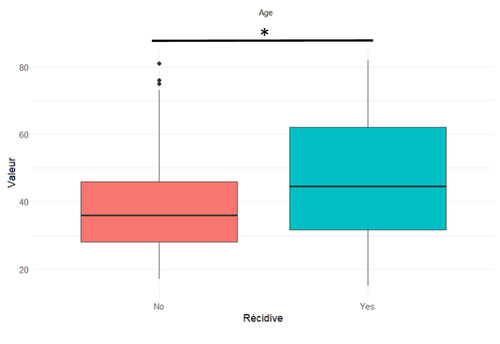
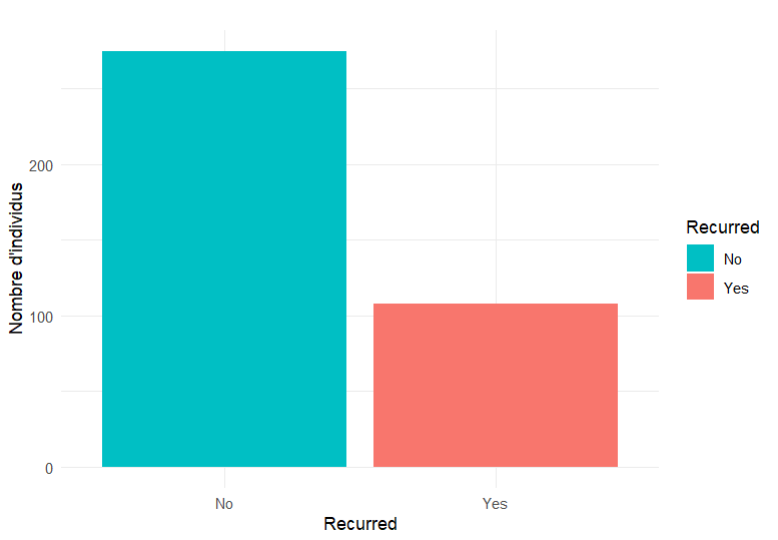
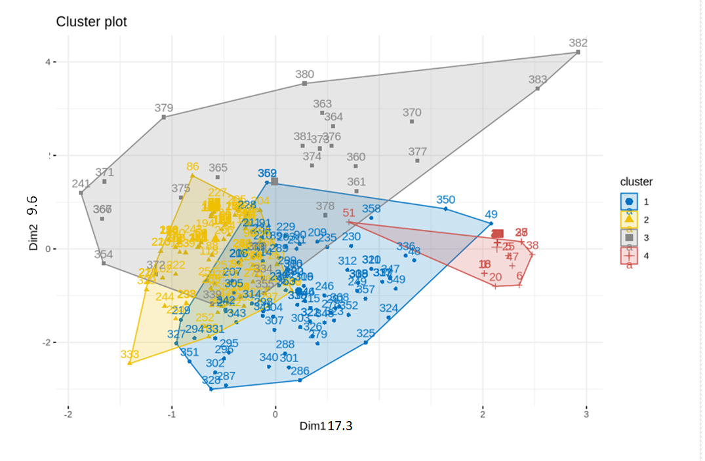
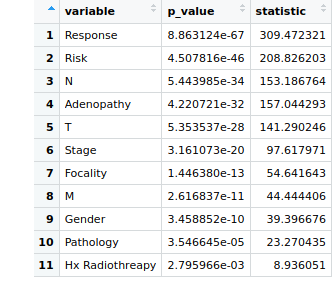
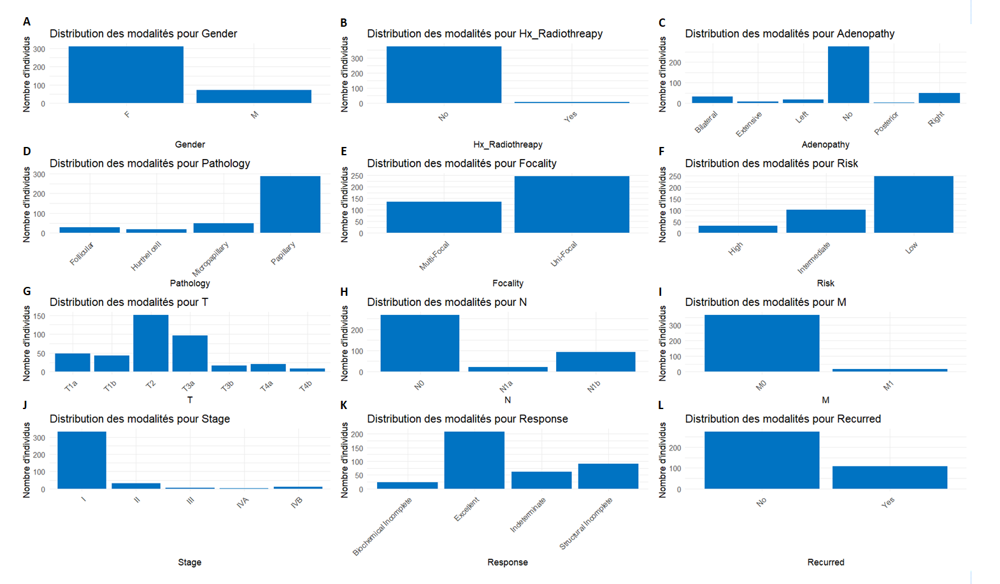
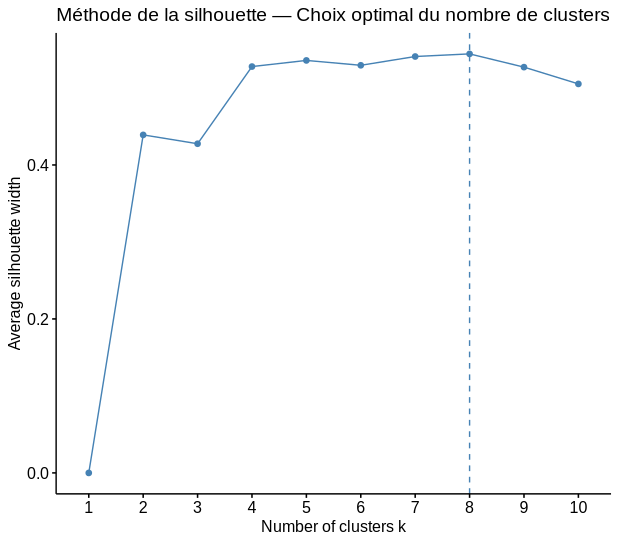

# Rapport de fouille

## La fouille de données au service de la médecine
Antonin MÉNARD – Florent LE QUELLEC

---

## Sommaire

- [Introduction](#introduction)
- [Matériel et Méthode](#matériel-et-méthode)
- [Résultats](#résultats)
  - [Analyse exploratoire](#analyse-exploratoire)
  - [Adenopathy](#adenopathy)
  - [Focality](#focality)
  - [Gender](#gender)
  - [Hx Radiotherapy](#hx-radiotherapy)
  - [Métastase (M)](#métastase-m)
  - [Ganglion touché (N)](#ganglion-touché-n)
  - [Taille (T)](#taille-t)
  - [Pathology](#pathology)
  - [Response](#response)
  - [Risk](#risk)
  - [Stage](#stage)
  - [Clustering](#clustering)
  - [Classification](#classification)
- [Conclusion](#conclusion)
- [Bibliographie](#bibliographie)
- [Annexes](#annexes)

---

# Introduction

Une tumeur se caractérise par la prolifération anormale de cellules dont le système de division est déréglé, conduisant à la formation d’une masse. Cette tumeur peut être bénigne (localisée, sans caractère invasif) ou maligne (capable d’envahir les tissus voisins ou de se propager à distance). Lorsqu’une tumeur est maligne, on parle alors de tumeur cancéreuse, ou plus simplement de cancer.[1][2]

Dans notre cas, nous nous intéressons au cancer de la thyroïde, qui représente environ 5 % des tumeurs thyroïdiennes, et qui est essentiellement diagnostiqué chez des femmes[3]. Ce cancer reste relativement rare en France, mais son incidence est en augmentation constante depuis plusieurs années, notamment grâce à l'amélioration des techniques de détection[4]. D’après la Société canadienne du cancer, sur 6 600 nouveaux cas de cancer de la thyroïde diagnostiqués en une année, environ 280 décès sont enregistrés, soit un taux de mortalité de 4,2 %. Il s’agit en réalité d’un cancer au pronostic globalement favorable, mais qui nécessite un suivi attentif en raison des risques de récidive. [5]
Grâce à la fouille de données, il devient possible d'explorer de grands ensembles de données cliniques afin de détecter des profils à risque, des relations cachées entre variables, ou encore de prédire des issues médicales comme dans notre cas : la récidive. Cela permet de transformer des données statiques en connaissances utilisables pour la recherche médicale.

Ce projet a pour objectif d’explorer un jeu de données clinique regroupant 383 patients atteints de cancer de la thyroïde, dans le but de :
Identifier les variables les plus fortement liées à la récidive
Regrouper les patients selon des profils communs (clustering)
Tester des modèles de classification pour prédire la récidive
Pour répondre à ces objectifs, une série d’analyses ont été menées : analyse exploratoire des données, application d’une Analyse des Correspondances Multiples (ACM) pour la réduction de dimension, clustering non supervisé par k-means pour détecter des groupes de patients similaires, et enfin des modèles supervisés (arbre de décision, forêt aléatoire, modèle bayésien) ont été évalués pour prédire la récidive.

---

# Matériel et Méthode

Notre jeu de données provient du site Kaggle. Ce jeu de données porte sur la récidive du cancer de la thyroïde après un traitement par iode radioactif (RAI). Il regroupe les informations cliniques de 383 patients, décrites à travers 13 variables clés, telles que l’âge, le sexe, le type de pathologie, le stade du cancer, la classification du risque, la réponse au traitement et la survenue éventuelle d’une récidive.

Ces données sont particulièrement utiles pour prédire le risque de récidive, mieux comprendre les facteurs de risque associés et évaluer l’efficacité des traitements administrés.

Le jeu de données comprend 13 variables décrivant les caractéristiques cliniques, pathologiques et thérapeutiques de 383 patients atteints d’un cancer de la thyroïde. Parmi ces variables, une seule est quantitative : l’âge du patient. Les douze autres sont qualitatives et couvrent des aspects variés tels que le sexe, les antécédents de radiothérapie, la présence de ganglions lymphatiques atteints (Adenopathy), le type histologique de la tumeur (Pathology), la focalité tumorale, ou encore la classification TNM (T, N, M). On y trouve également des variables résumant le stade global du cancer (Stage), la réponse au traitement (Response), et enfin la présence ou non d’une récidive (Recurred), qui constitue la variable cible dans les analyses de classification. L’ensemble de ces variables permet d’analyser en profondeur les profils de patients et d’explorer les facteurs potentiels de récidive. Pour plus d'information, consulter les tableaux annexes 1, 2 et 3.

Les données ont été traitées à l’aide de R (version 4.4.2) et de RStudio pour la phase d’analyse exploratoire et de clustering. Les packages utilisés incluent :
tidyverse (Wickham et al., 2019), ggplot2 (Wickham, 2016) et patchwork (Pedersen, 2024) pour la manipulation des données et la création de visualisations graphiques,
Cluster (Maechler et al., 2025), FactoMineR (Lê, Josse & Husson, 2008) et factoextra (Kassambara & Mundt, 2020) pour la réalisation de l’analyse des correspondances multiples (ACM),
plotly (Sievert, 2020) pour les visualisations interactives en trois dimensions,

L’ensemble des données a été soumis à plusieurs étapes de prétraitement avant l’analyse :

Conversion des variables catégorielles au format factor afin de permettre une analyse statistique adaptée,
Analyse univariée par la création de statistiques descriptives, d’histogrammes pour les variables numériques et de diagrammes en barres pour les variables catégorielles,
Réalisation de tests de normalité (Shapiro-Wilk) et de variance (F-test), ainsi qu’un test de Wilcoxon sur la variable Âge afin de comparer les groupes avec et sans récidive,
Application du test du Chi² pour évaluer l’indépendance entre les variables qualitatives et la variable cible Recurred,
Transformation des données au format long pour les représentations graphiques avec ggplot2,
Réalisation d’une ACM afin de réduire la dimensionnalité des données catégorielles en amont du clustering et réalisation d’un diagramme de silhouette pour représenter le nombre idéal de groupements de patients pour nos analyses, sur base d’un calcul de score de silhouette qui détermine la qualité de ces groupements,
Clustering non supervisé par la méthode des k-means sur les premières dimensions issues de l’ACM,
Interprétation des clusters par croisement avec les variables cliniques et la variable cible.

La phase de classification supervisée a été effectuée à l’aide de KNIME (version 5.4.3). À partir du fichier de données complet, plusieurs modèles ont été testés. Une validation croisée a été mise en place à l’aide des nœuds Partitioning (pour séparer les jeux d’apprentissage et de test) et X-Aggregator (pour compiler les résultats). Cela a permis d’évaluer la robustesse des modèles selon des métriques telles que le taux d’erreur moyen, le nombre moyen d’erreurs et la taille moyenne du jeu de test.

---

# Résultats

## Analyse exploratoire

Répartition de nos variables catégorielles (annexe 5)
Bien que notre nombre d’individus soit d’une taille respectable compte tenu des analyses qui vont être réalisées dessus, il demeure certains déséquilibres dans la répartition des modalités de nos données.
Les modalités présentes en majorité sont celles indiquant que les patients n’ont pas subi de radiographie Hx, n’ont pas d’adénopathie, ont un cancer à un niveau de développement intermédiaire, n’ont pas de métastase ou de tumeur qui aurait atteint au moins un ganglion, ont un cancer unilocal, une excellente réponse au traitement et un risque de propagation du cancer faible (un nombre inférieur, mais non négligeable d’individus possèdent un risque intermédiaire).
Tous ces éléments nous indiquent que la majorité de nos patients sont atteints de cancers relativement peu développés et qui réagissent bien au traitement, en lien avec le taux relativement faible de récidive. 
En outre, la majorité de nos individus sont atteints d’un cancer de type papillaire et sont des femmes (en conformité avec le sex ratio des patients atteints d’un cancer de la thyroïde), bien que notre échantillon d’individus hommes soit d’une taille acceptable (312 contre 71).

### Répartition des variables catégorielles

La figure 1 est une représentation de la distribution des différentes modalités pour chacune de nos variables catégorielles en fonction d’une récidive ou non du cancer (Recurred). Ce sont des barres empilées exprimées en pourcentage, afin d’observer la proportion relative de récidive pour chaque modalité.

### Adenopathy
Les patients avec récidive sont présents chez 100% des patients des groupes “Extensive”, “Posterior” et sont très représentés dans les groupes “Left”, “Bilateral” et “Right, tandis que l'absence d'adénopathie (“No”) est majoritairement associée à l'absence de récidive.

Cela suggère un lien fort entre le fait d’avoir une adénopathie et le risque de récidive, certaines adénopathies semblant être associées à des risques plus élevés de récidive.

### Focality
Les cas de tumeurs multi-focaux présentent une proportion nettement plus élevée de récidive que les cas uni-focaux. Cela renforce l’idée qu’un cancer multifocal est plus agressif et par conséquent, plus difficile à éradiquer complètement.

### Gender
Les hommes semblent avoir une fréquence de récidive plus élevée que les femmes. Ceci pourrait indiquer qu’il existe un facteur de risque lié au sexe.

### Hx Radiotherapy
Les patients ayant déjà subi une radiothérapie ont plus de récidives que ceux qui n’en ont pas eu. Cela pourrait refléter un cancer plus avancé au départ ou bien une résistance accrue. Il est cependant important de prendre en compte qu'une forte majorité des patients n’ont pas eu de radiothérapie.

### Métastase (M)
La présence d’une métastase est associée fortement à la récidive. Ce résultat est en cohérence avec le fait que ce cancer soit à un niveau de développement plus avancé.

### Ganglion touché (N)
Le pourcentage de récidive est faible pour les patients N0, moyen pour les patients N1a et élevé pour les patients N1b.  Pour rappel, le taux de récidive sur l’ensemble des patients est de 28%, posséder un cancer N1b est donc un facteur plus fréquemment associé à la récidive.

Ce résultat met en évidence l’importance du statut ganglionnaire dans le risque de rechute.

### Taille (T)
On observe une augmentation progressive du risque de récidive avec le développement du cancer. Les tailles tumorales les plus petites (T1 et T2) sont associées à peu de récidives, contrairement aux tumeurs de grande taille (T3-T4) qui montrent des fréquences élevées de récidive (T3a possède un risque de récidive intermédiaire).
### Pathology
Les cancers papillaires, folliculaires et les cancers à cellules de Hürthle sont davantage associés à la récidive (aux alentour de 35% des cas pour les trois cancers). Aucune récidive de cancer n’a été observée chez les patients atteints d’un cancer micro-papillaire.

### Response
Une réponse structurale incomplète au traitement est fortement associée à la récidive. Une réponse biochimique incomplète est associée à la récidive dans près de la moitié des cas. Pour rappel, le taux de récidive sur l’ensemble des patients est de 28%, une réponse biochimique incomplète est donc un facteur plus fréquemment associé à la récidive. Une réponse excellente aux traitements est associée à un taux de récidive très faible, conformément aux attentes cliniques.

### Risk
Tous les patients à haut risque ont récidivé, tandis que ceux à faible risque récidivent rarement (4.8%). Les patients ayant un risque intermédiaire sont associés à un risque de récidive situé entre ces deux valeurs, mais l’association demeure assez forte. Ces résultats montrent l’existence d’une association positive entre le risque de propagation et le risque de récidive, en conformité avec ce que l’on pourrait attendre d’un cancer plus agressif.

### Stage

On constate une augmentation du risque de récidive avec l’évolution du cancer au fil des stades, en cohérence avec nos résultats sur les classifications TNM. Le stade I est le seul associé à un risque de récidive assez faible (19.5%), le stade II est associé majoritairement à des patients ayant connu une rechute, et les stades III, IVB, IVA sont associés à de la récidive dans 100% des cas.

---

## Clustering

Description des 4 clusters.

---

## Classification

Description des 4 modèles testés.

---

# Conclusion

*(Texte détaillé inchangé)*

---

# Bibliographie

*(Liste de références numérotées)*

---

# Annexes

## Annexe 1 : Description des variables utilisées

*(Tableau à insérer)*

## Annexe 2 : Classification TNM [6][7]

*(Tableau à insérer)*

## Annexe 3 : Classification des cancers par stade [8]

*(Tableau à insérer)*

## Annexe 4 : Caractéristiques des clusters

## Annexe 5 : Diagrammes en barre des variables

## Annexe 6 : Graphique silhouette

---

